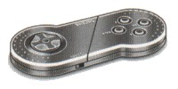
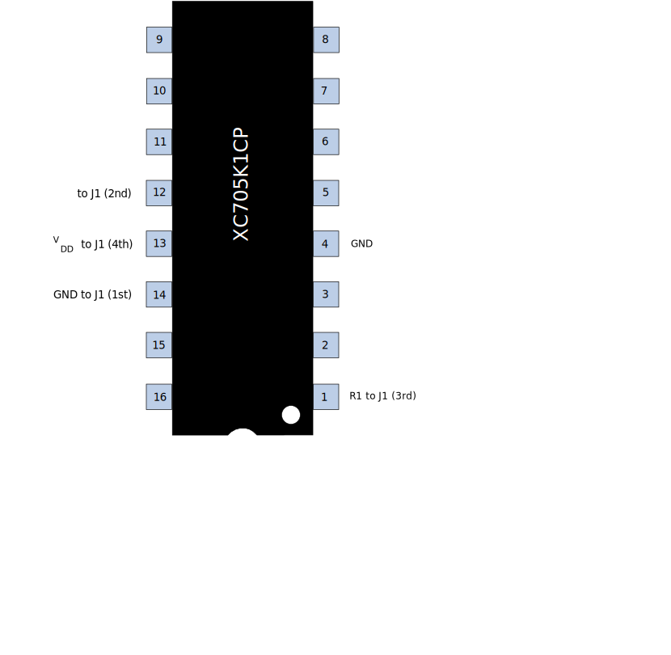

# CD-i Touchpad Schematics

Information about the schematics of the PCB for the Logitech-built
Philips-branded “Touchpad 22ER9017”, a SNES-looking 4-button joypad. It's quite
clearly based off a [Gravis gamepad](https://en.wikipedia.org/wiki/Gravis_PC_GamePad).

It has 2 switches, one to toggle the cursor speed when emulating a
pointing device, and one to make the joypad left-handed/upside-down.

## Protocol

The protocol used is a simple serial protocol, with the player telling the joypad
when to send data. More information is available in this [Technical Info -
 Pointing Devices](https://archive.org/details/philips_cdi_pointing_devices)
document.

## PCBs

## Connector pinout

| J1 pin       | Joypad   | Din 8 pin | Cable colour | Reason |
| ------------ |----------|-----------|--------------| -------|
| 1 (top)      | GND      | 5         | Brown | connects with metal shielding of switches |
| 2            | RXD      | 2         | Black | (the only one left ;) |
| 3            | RTS      | 7         | Red | connects through R1, a 150kΩ resistor (value used for [pull-down in CMOS applications](http://www.resistorguide.com/pull-up-resistor_pull-down-resistor/))|
| 4 (bottom)   | 5V/VDD   | 8         | Orange | connects through all the buttons and switches to an MCU pin)

The GND, VDD and RTS values were guessed with the reasons indicated, and
cross-referenced with this [very confusing repair guide](http://web.archive.org/web/20141014171652/https://cdii.blogspot.com/2007/03/little-help-repairing-cd-i-controller.html)
and the [schematics for joypad pinouts in the SNEStoCDi project](https://github.com/anarterb/SNEStoCDi/blob/master/wiring.jpg).

## MCU

The only chip on the board is a DIP-16 Motorola XC705K1CP branded
as a Logitech `330078-00 LOGITECH 93`.

